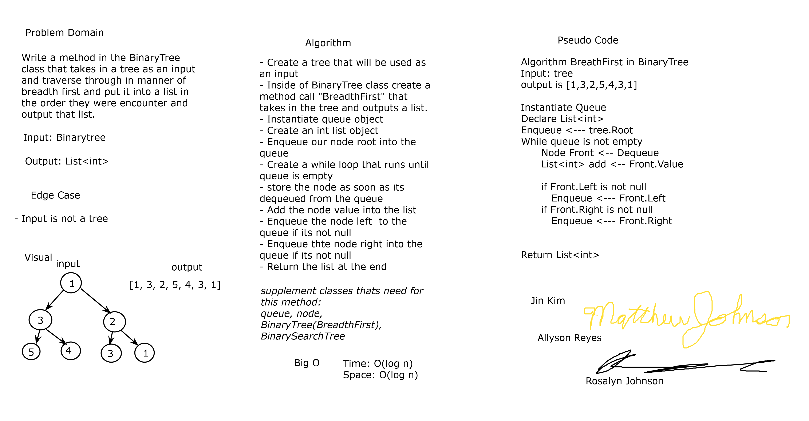

# Breadth First
*Author: Allyson Reyes, Rosalyn Johnson, Jin Kim, Matthew Johnson*

---

### Problem Domain
Create a method that takes in a binary tree. This method needs to traverse through the tree using breadth first. Return the list of values in the correct order it was traversed through. 

---

### Inputs and Expected Outputs

| Input |Expected Output |
| :----------- | :----------- |
| Binary tree |a list of the values in order by each lvl from left to right |

---
### Big O
| Time | Space |
| :----------- | :----------- |
| O(n) | O(n) |

---

### Whiteboard Visual

---

### Change Log  
1.2: *Readme* - 3.31.2020    
1.1: *Started out the whiteboarding* - 04.08.2020

