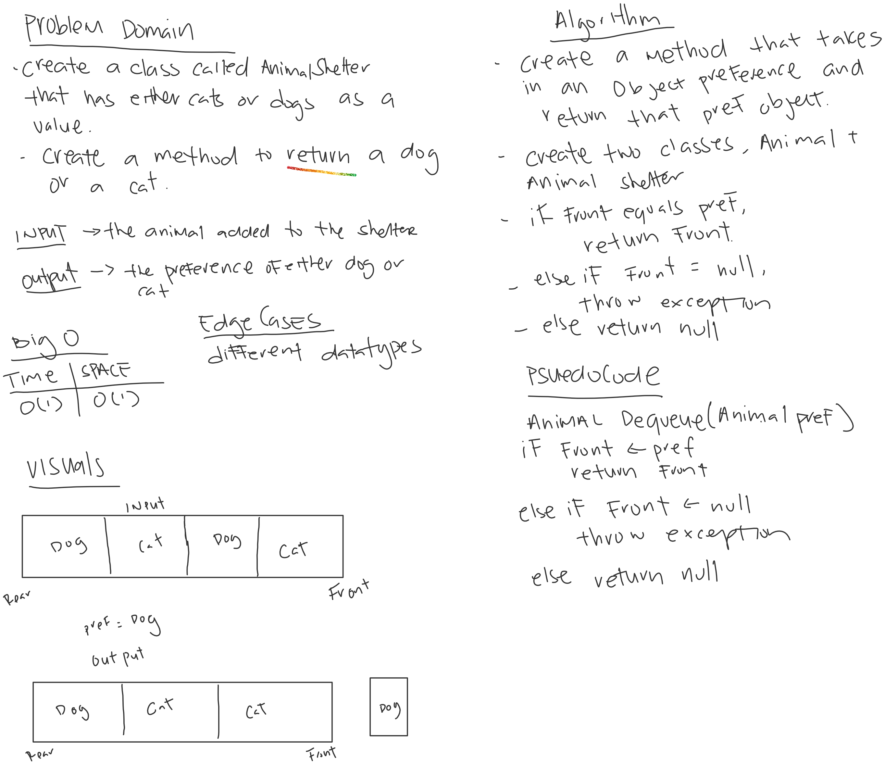

# Animal Shelter

*Author: Allyson Reyes*

---

### Problem Domain
Create a method that takes in a pref and when enqueuing, return that pref. If pref of not cat or dog, return null.

---

### Inputs and Expected Outputs

| Input | Arg  |Expected Output |
| :----------- | :----------- |
| Rear - Cat - Dog - Cat -Front |Dog | Rear - Cat - Cat -Front |

---
### Big O
| Time | Space |
| :----------- | :----------- |
| O(1) | O(1) |

---

### Whiteboard Visual

---

### Change Log  
1.3: *Readme* - 3.31.2020  
1.2: *created tests and Deq method* - 3.31.2020  
1.2: *created tests and Enqueue method* - 3.31.2020  
1.1: *Started out the whiteboarding* - 3.31.2020

