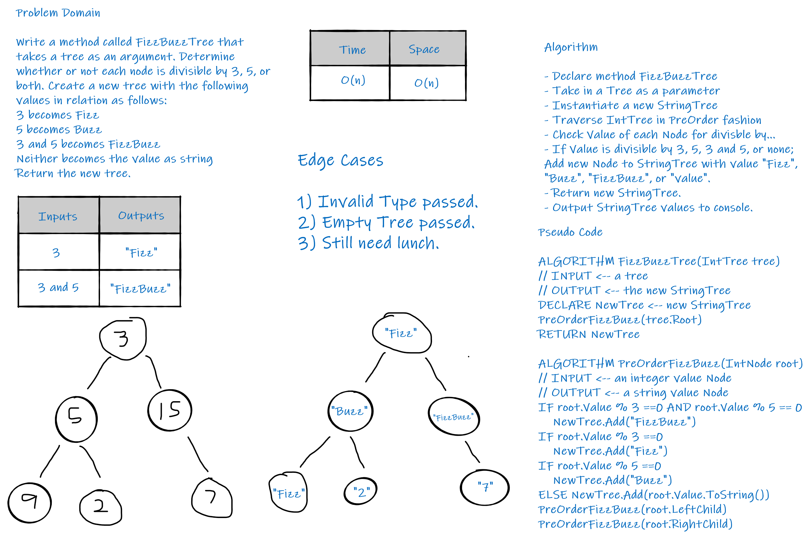

# Trees
*Author: Allyson Reyes and Robert Nielsen*

---

### Problem Domain
Create a method called FizzBuzzTree that takes a tree in as an argument. Determine whether ot not each node is divisible by 3,5, or both. Create a new tree withs the following values in relation: 3 becomes Fizz, 5 becomes Buzz, 3 and 5 becomes FizzBuzz and if neither, the value becomes a string. Return the new tree

---

### Inputs and Expected Outputs

| Input | Expected Output |
| :----------- | :----------- |
| 3 | Fizz |
| 5 | Buzz |
| 3,5 | FizzBuzz |
| 2 | "2" |

---
### Big O
| Time | Space |
| :----------- | :----------- |
| O(n) | O(n) |

---

### Whiteboard Visual

---

### Change Log  
1.3: *readme* - 04.07.2020  
1.2: *Created the methods* - 04.07.2020  
1.1: *Started out the whiteboarding* - 04.07.2020

