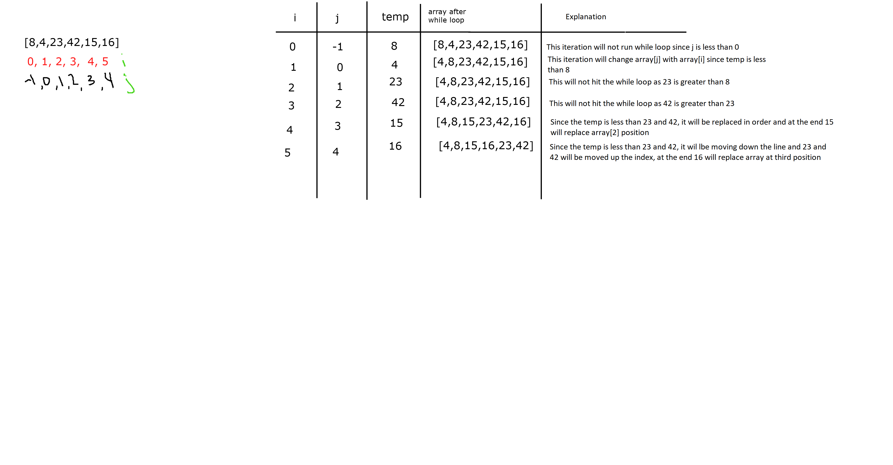

# Insertion Sort

*Author: Allyson Reyes and Jin Kim*

---

### Problem Domain
Insertion Sort is a sorting algorithm that traverses through an array one at a time comparing the iteration to a temp. The temp is compared to the iteration before and if the temp is less than the iteration, the temp will replace the it. 

---

### PsuedoCode
```cs
  InsertionSort(int[] arr)
  
    FOR i = 1 to arr.length
    
      int j <-- i - 1
      int temp <-- arr[i]
      
      WHILE j >= 0 AND temp < arr[j]
        arr[j + 1] <-- arr[j]
        j <-- j - 1
        
      arr[j + 1] <-- temp

    return arr
```
---
### Big O
| Time | Space |
| :----------- | :----------- |
| O(n^2) | O(1) |

Time: There is a while loop in a for loop. It is nested

Space: The array is sorted in place and there is no extra space that needs to be created.

---

### Whiteboard Visual



---

### Change Log  
1.3: *Blog* - 04.20.2020  
1.2: *created method* - 04.20.2020  
1.1: *Started out the whiteboarding* - 04.20.2020

