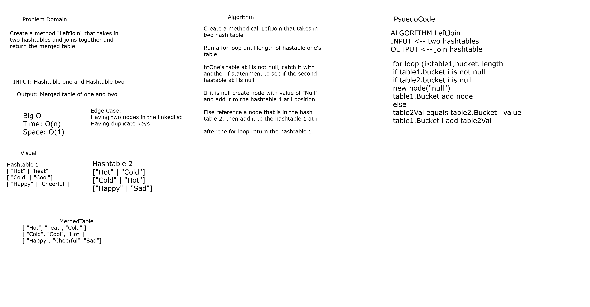

# Left Join

*Author: Allyson Reyes and Jin Kim*

---

### Problem Domain
Create a method called left join that takes in two hashtables and combine the key and corresponding values into a new data structure.

---
### Visual 

---
### Inputs and Expected Outputs

**Inputs**  

Hashtable1:  

| Key | Value |
| :----------- | :----------- |
| "hot" | "heat"|
| "happy" | "joyful"|

Hashtable2:  

| Key | Value |
| :----------- | :----------- |
| "hot" | "cold"|
| "happy" | "sad"|

**Output**  

["hot", "heat", "cold"]  
["happy", "joyful", "sad"]

---

### Big O

| Time | Space |
| :----------- | :----------- |
| O(n) | O(1)|

---

### Change Log    
1.3: *readme* - 4/30/2020  
1.2: *Created method* - 4/30/2020  
1.1: *Created whiteboard* - 4/30/2020  
