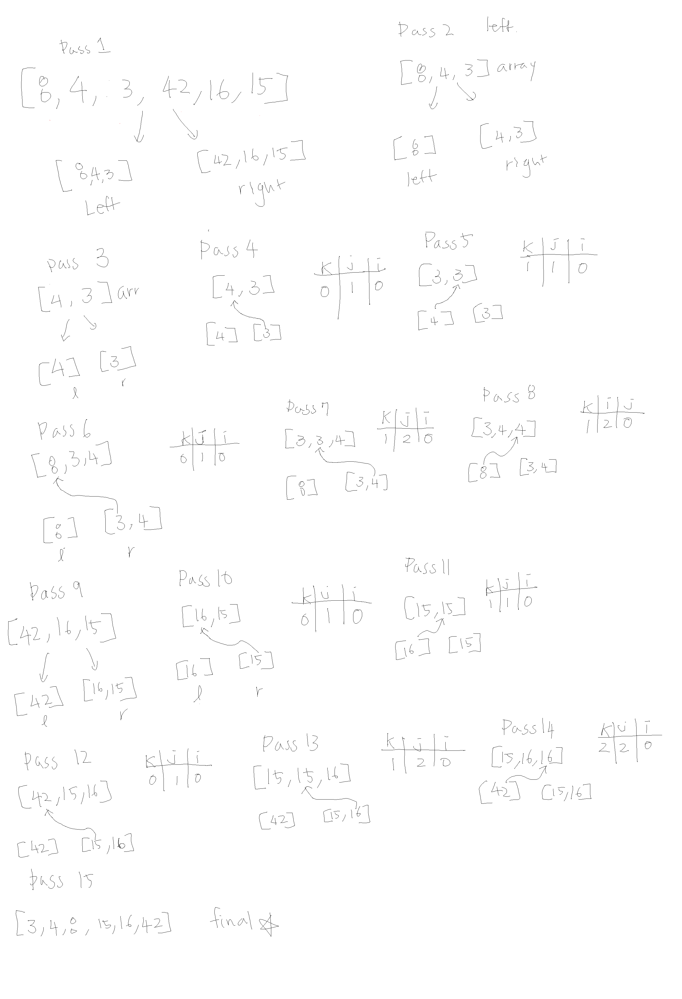

# Insertion Sort

*Author: Allyson Reyes and Jin Kim*

---

### Problem Domain
This Merge Sort divides and conquers the array. It splits the array in half, checks the left side then the right, takes the values out

---

### PsuedoCode
```
ALGORITHM Mergesort(arr)
    DECLARE n <-- arr.length
           
    if n > 1
      DECLARE mid <-- n/2
      DECLARE left <-- arr[0...mid]
      DECLARE right <-- arr[mid...n]
      // sort the left side
      Mergesort(left)
      // sort the right side
      Mergesort(right)
      // merge the sorted left and right sides together
      Merge(left, right, arr)

ALGORITHM Merge(left, right, arr)
    DECLARE i <-- 0
    DECLARE j <-- 0
    DECLARE k <-- 0

    while i < left.length && j < right.length
        if left[i] <= right[j]
            arr[k] <-- left[i]
            i <-- i + 1
        else
            arr[k] <-- right[j]
            j <-- j + 1
            
        k <-- k + 1

    if i = left.length
       set remaining entries in arr to remaining values in right
    else
       set remaining entries in arr to remaining values in left
```
---
### Big O
| Time | Space |
| :----------- | :----------- |
| O(n log n) | O(n) |

Time: Uses recursion.

Space: We create the left and right array for it to be stored in.

---

### Whiteboard Visual



---

### Change Log  
1.3: *Blog* - 04.21.2020  
1.2: *created method* - 04.21.2020  
1.1: *Started out the whiteboarding* - 04.21.2020

