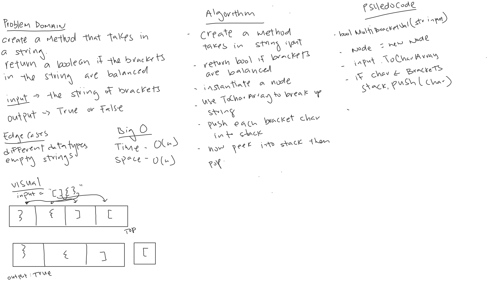

# Multi Bracket Validation

*Author: Allyson Reyes*

---

### Problem Domain
Create a method that takes a string input and return a boolean if the input has balanced brackets.

---

### Inputs and Expected Outputs

| Input | Expected Output |
| :----------- | :----------- |
| `{}` | TRUE |
| `}[()` | FALSE |

---
### Big O
| Time | Space |
| :----------- | :----------- |
| O(n) | O(n) |

---

### Whiteboard Visual

---

### Change Log  
1.2: *Readme* - 04.02.2020  
1.3: *tried out method* - 04.02.2020  
1.2: *created the classes of node and stack* - 04.02.2020  
1.1: *Started out the whiteboarding* - 04.02.2020

