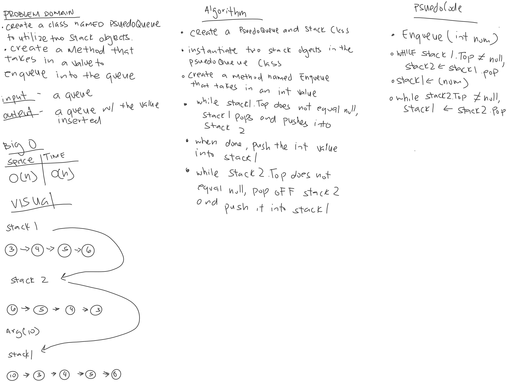

# QueueWithStacks

*Author: Allyson Reyes*

---

### Problem Domain
Use a class named PsuedoQueue to utilize two Stack objects. Create a method that takes in a value to enqueue into the queue. 

---

### Inputs and Expected Outputs

| Input | Arg | Expected Output |
| :----------- | :----------- |
| [3]->[5]->[7] | 1 | [1]->[3]->[5]->[7] |

---
### Big O
| Time | Space |
| :----------- | :----------- |
| O(n) | O(n) |

---

### Whiteboard Visual

---

### Change Log  
1.2: *Readme* - 3.29.2020  
1.3: *created the tests* - 3.3-.2020  
1.2: *Created the enqueue method* - 3.30.2020  
1.1: *Started out the whiteboarding* - 3.30.2020

