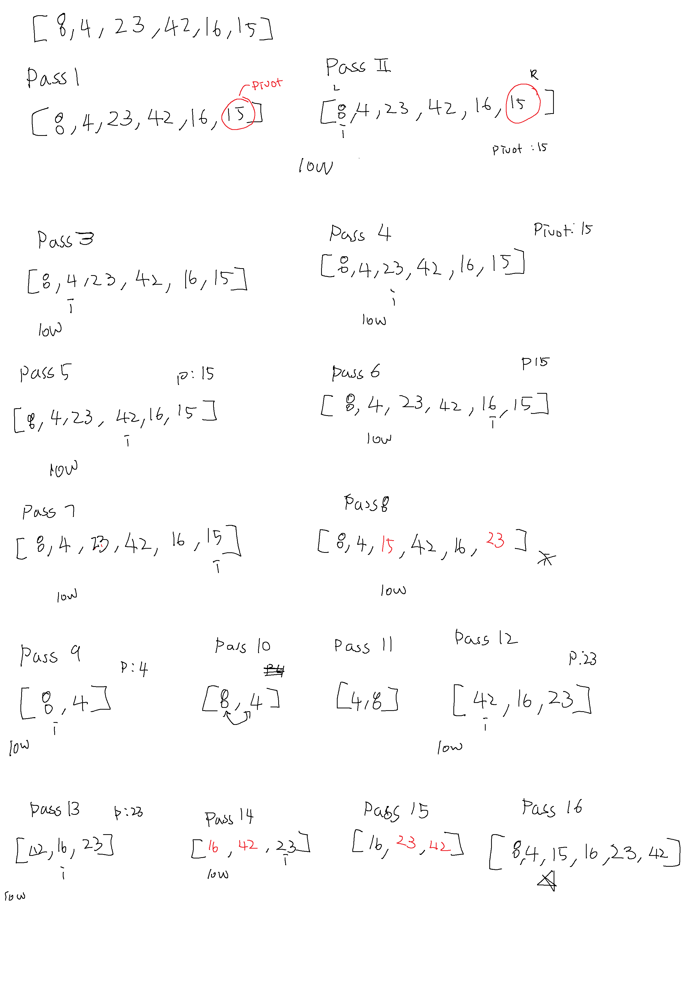

# Quick Sort

*Author: Allyson Reyes and Jin Kim*

---

### Problem Domain
Quick Sort is a sorting algorithm that chooses a pivot and divides the array surrounding that pivot. When a pivot is chosen, the array is sorted where the values smaller than the pivot will go before and greater values go after. Then you would do this recursively to the left then the right side until the whole array is sorted. 

---

### PsuedoCode
```
ALGORITHM QuickSort(arr, left, right)
    if left < right
        // Partition the array by setting the position of the pivot value 
        DEFINE position <-- Partition(arr, left, right)
        // Sort the left
        QuickSort(arr, left, position - 1)
        // Sort the right
        QuickSort(arr, position + 1, right)

ALGORITHM Partition(arr, left, right)
    // set a pivot value as a point of reference
    DEFINE pivot <-- arr[right]
    // create a variable to track the largest index of numbers lower than the defined pivot
    DEFINE low <-- left - 1
    for i <- left to right do
        if arr[i] <= pivot
            low++
            Swap(arr, i, low)

     // place the value of the pivot location in the middle.
     // all numbers smaller than the pivot are on the left, larger on the right. 
     Swap(arr, right, low + 1)
    // return the pivot index point
     return low + 1

ALGORITHM Swap(arr, i, low)
    DEFINE temp;
    temp <-- arr[i]
    arr[i] <-- arr[low]
    arr[low] <-- temp
```
The Quick sort methid takes in 3 arguments, the arr, left and right. Left being the beginning of the array and the right, then end. If left is less that right, the Partition method is called to set the position of the pivot then the Quick Sort method is recursively called to sort the left then called again to sort the right.  
The Partition method has two trackers. There will be one to compare the largest index to the nums lower than the pivot and one that increments to go through the array. The swap method is called and the pivot is placed in the correct placement of the middle with lower nums in front and larger after.  
The Swap method swaps the i position with the low tracker. 


---
### Big O
| Time | Space |
| :----------- | :----------- |
| O(log n) | O(log n) |

Time: We are using recursion with a method that has a for loop.

Space: We are not creating additional space.

---

### Whiteboard Visual



---

### Change Log  
1.3: *Blog* - 04.22.2020  
1.2: *created method* - 04.22.2020  
1.1: *Started out the whiteboarding* - 04.22.2020

