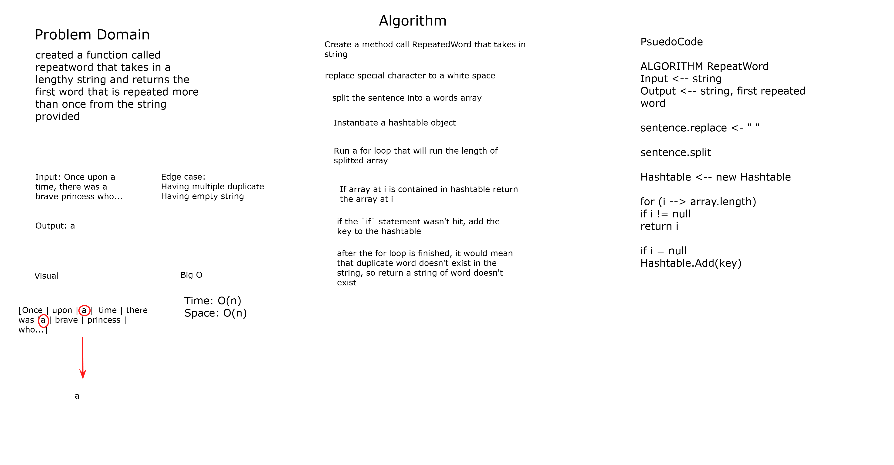

# Repeated Word

*Author: Allyson Reyes and Jin Kim*

---

### Problem Domain
Created a method called Repeated Word that takes in a lengthy string and returns the first word that is repeated more than once. 

---
### Visual 

---
### Inputs and Expected Outputs

| Input | Expected Output |
| :----------- | :----------- |
| "My first dog is named Kudo and my second dog is named Mochi" | "dog"|

---

### Big O

| Time | Space |
| :----------- | :----------- |
| O(n) | O(n)|

---

### Change Log    
1.3: *readme* - 4/27/2020  
1.2: *Created method* - 4/28/2020  
1.1: *Created whiteboard* - 4/28/2020  
