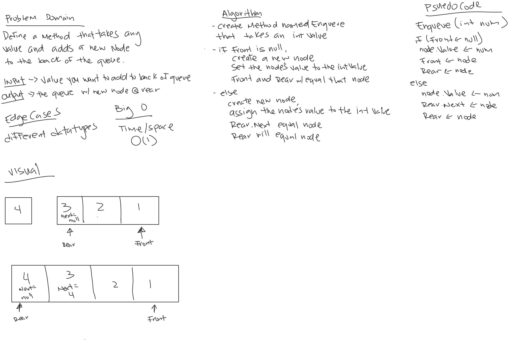

# Stacks and Queues

*Author: Allyson Reyes*

---

### Problem Domain
Create a method that takes in any value as an argument.
Add a new node with the value into the back of the queue.

---

### Inputs and Expected Outputs

| Input | Expected Output |
| :----------- | :----------- |
| 3 | Rear - 3 - 5 - 2 -Front |

---
### Big O
| Time | Space |
| :----------- | :----------- |
| O(1) | O(1) |

---

### Whiteboard Visual

---

### Change Log  
1.2: *Readme* - 3.29.2020  
1.3: *created tests and methods for Queues* - 3.29.2020  
1.2: *created tests and methods for Stacks* - 3.29.2020  
1.1: *Started out the whiteboarding* - 3.29.2020

