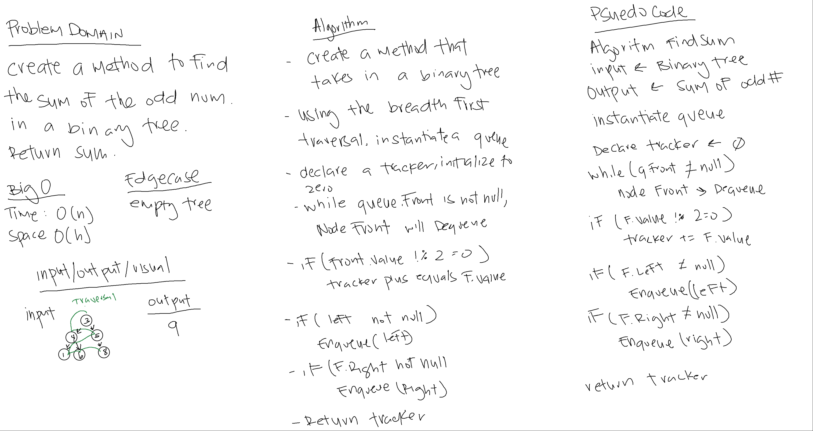

# Max Value Binary Tree

*Author: Allyson Reyes*

---

### Problem Domain
Create a method that traverses through a binary tree and returns the sum of all the odd numbers within the tree. 

---

### Inputs and Expected Outputs

| Input | Expected Output |
| :----------- | :----------- |
| Binary tree    |Sum of odd nums in tree|

---
### Big O
| Time | Space |
| :----------- | :----------- |
| O(n) | O(h) |

---

### Whiteboard Visual

---

### Change Log  
1.5: *README* - 04.10.2020  
1.4: *Testing* - 04.10.2020  
1.3: *create the method in the binary tree class* - 04.10.2020  
1.2: *created the classes of node, queue, binary tree, and binary search tree* - 04.10.2020  
1.1: *Started out the whiteboarding* - 04.10.2020

