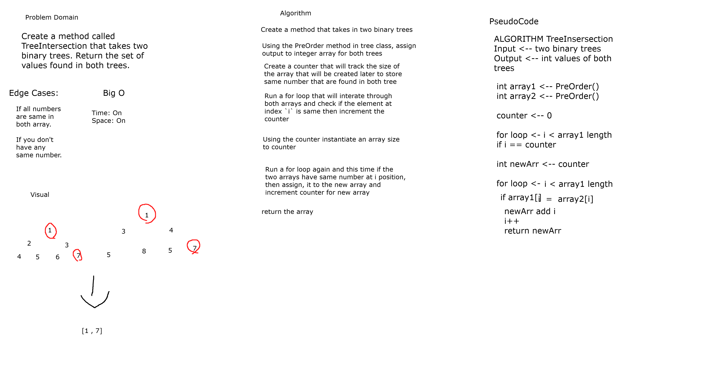

# Tree Intersection

*Author: Allyson Reyes and Jin Kim*

---

### Problem Domain
Created a method called Tree Intersection that takes two binary trees and returns a set of values found in both arrays. 

---
### Visual 

---
### Inputs and Expected Outputs

| Input | Input 2|Expected Output |
| :----------- | :----------- | :----------- |
|Values in tree 1 (1,2,3,4)  | Values in tree 2 (4,5,6) | 4 |

---

### Big O

| Time | Space |
| :----------- | :----------- |
| O(n) | O(n)|

---

### Change Log    
1.3: *readme* - 4/29/2020  
1.2: *Created method* - 4/29/2020  
1.1: *Created whiteboard* - 4/29/2020  
