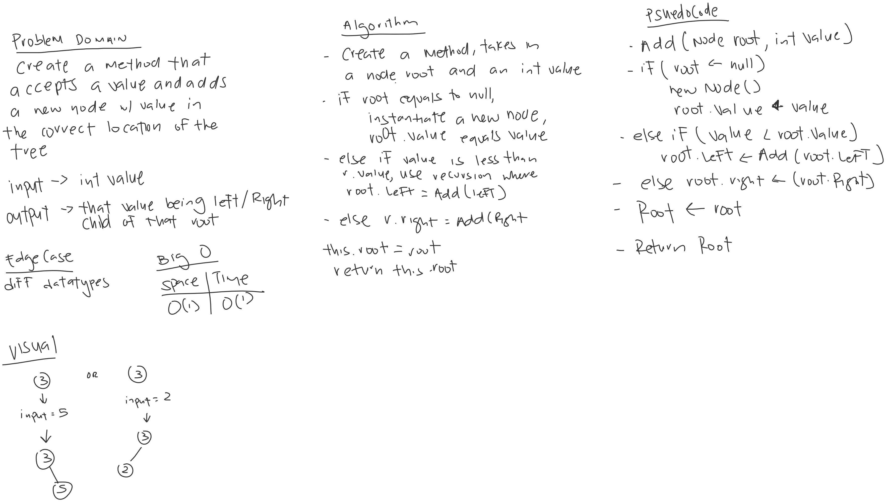

# Trees
*Author: Allyson Reyes*

---

### Problem Domain
Create a method that accepts a value and adds a new node with the value in the correct location in the tree.

---

### Inputs and Expected Outputs

| Input | Expected Output |
| :----------- | :----------- |
| 3 | if 4 was the root, 3 would be LeftChild |

---
### Big O
| Time | Space |
| :----------- | :----------- |
| O(1) | O(1) |

---

### Whiteboard Visual

---

### Change Log  
1.5: *readme* - 04.06.2020  
1.4: *Created pre/in/post order methods in BinaryTree class* - 04.06.2020  
1.3: *Created add and contain method in BinarySearchTree class* - 3.29.2020  
1.2: *Created the 3 different classes* - 04.06.2020  
1.1: *Started out the whiteboarding* - 04.06.2020

